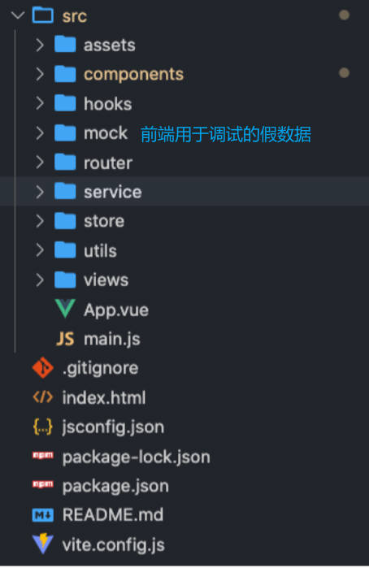

# 创建项目

使用 create-vue 脚手架创建项目。

```shell
npm install vue@latest
```

# 基本配置

## 配置 icon

路径：public / favicon.ico

## 替换 title

方案一：在项目根目录 index.html 中直接修改

```html
<title>ZT旅途</title>
```

方案二：在代码中动态修改

```js
document.title = 'ZT旅途'
```

## 配置 jsconfig.json

有利于在 VSCode 中的语法提示。

# 项目目录结构划分



# CSS 样式重置

安装 normalize.css，并在 main.js 中引入

```shell
npm install normalize.css
```

编写 reset.css，并在 main.js 中引入

```css
body, h1, h2, h3, h4, ul, ol, li {
	margin: 0;
	padding: 0;
}
ul, li {
	list-style: none;
}
a {
	text-decoration: none;
	color: #333;
}
img {
	vertical-align: top;
}
```

src / assets / css / index.css

```css
@import './reset.css';
@import './common.css';
```

src / main.js

```js
import 'normalize.css'
import './assets/css/index.css'
```

-----

# 路由配置

添加 4 个路由映射，对应 4 个组件 Home, Favor, Order, Message

src / router / index.js

```js
import { createRouter, createWebHashHistory } from 'vue-router'

const router = createRouter({
  history: createWebHashHistory(),
  routes: [
    {
      path: '/',
      redirect: '/home'
    },
    {
      path: '/home',
      component: () => import('@/views/home/Home.vue')
    },
    {
      path: '/favor',
      component: () => import('@/views/favor/Favor.vue')
    },
    {
      path: '/order',
      component: () => import('@/views/order/HomOrdere.vue')
    },
    {
      path: '/message',
      component: () => import('@/views/message/Message.vue')
    }
  ]
})
export default router
```

> 在创建 Vue 组件时，如果使用 index.vue 来命名，那么在使用 devtools 调试时，需要给组件定义 `name` 属性来区分。

# 状态管理配置

使用 Pinia 配置状态管理。

src / stores / index.js

```js
import { createPinia } from "pinia";

const pinia = createPinia()
export default pinia
```

src / main.js

```js
import { createApp } from 'vue'
import pinia from "./stores";
import router from './router'
import App from './App.vue'
import 'normalize.css'
import './assets/css/index.css'

const app = createApp(App)
app.use(pinia)
app.use(router)
app.mount('#app')
```

src / stores / city.js

```js
import { defineStore } from "pinia";

const useCity = defineStore('city', {
	state: () => ({
		cities: []
	}),
	actions: {
	}
})
export default useCity
```

# 其它注意事项

VSCode 自定义模板中的占位写法：${1:home} 代表第一个占位，默认值是 home

-----

无论是 H5 端，还是移动端，下方的导航栏都被称为 TabBar。

-----

脚手架创建的项目，默认没有处理 less，安装 less：`npm install less -D`

-----

开发流程：完成任务 -> 进行封装 -> 简洁优雅，不要给自己加任务。

-----

# 开发 TabBar 组件

开发页面下方 TabBar 组件

src / components / TabBar.vue

```vue
<script setup>
import tabBarData from "@/assets/data/tab-bar";
import { getAssetURL } from "@/utils/load-asstes";
</script>

<template>
	<section class="tab-bar">
		<template v-for="item of tabBarData" :key="item.text">
			<div class="tab-bar-item">
				
				<span>{{item.text}}</span>
			</div>
		</template>
	</section>
</template>

<style scoped lang="less">
.tab-bar {
	position: fixed;
	bottom: 0;
	left: 0;
	right: 0;
	height: 50px;
	display: flex;
	border-top: 1px solid #f3f3f3;

	.tab-bar-item {
		flex: 1;
		display: flex;
		flex-direction: column;
		justify-content: center;
		align-items: center;
		img {
			width: 36px;
		}
		span {
			font-size: 12pz;
			margin-top: 2px;
		}
	}
}
</style>
```

## template 里的路径解析

### webpack 环境中

动态绑定图片路径，需要使用 `requier()` 函数

```vue
<template>
  
</template>
<script setup>
const imgPath = @/assets/img/tabbar/tab_home.png
</script>
```

### vite 环境中

静态绑定图片路径，可直接使用别名（alias）来引用路径，如：

```vue

```

动态绑定图片路径，如 :src="xxx"，如何处理 xxx 文件路径？

1. 封装一个工具函数；

   src / utils / load-asstes.js

   ```js
   /**
    * @description: 此函数用于：在 Vite 环境中，SFC 文件的 template 里，动态绑定图片资源路径。
    * @Author: ZeT1an
    * @param {String} image 图片名称
    * @return {*} 解析后可用于 template 中的路径
    */
   export const getAssetURL = (image) => {
   	// 在 vite 中，需要通过 ESModule 查找路径
     // new URL(prop1, prop2), prop1: 相对路径；prop2: 当前路径的 URL
     const url = new URL(`../assets/img/${image}`, import.meta.url)
     return url.href
   }
   ```

2. 在 template 中使用封装的函数。

	```vue
	
	```

