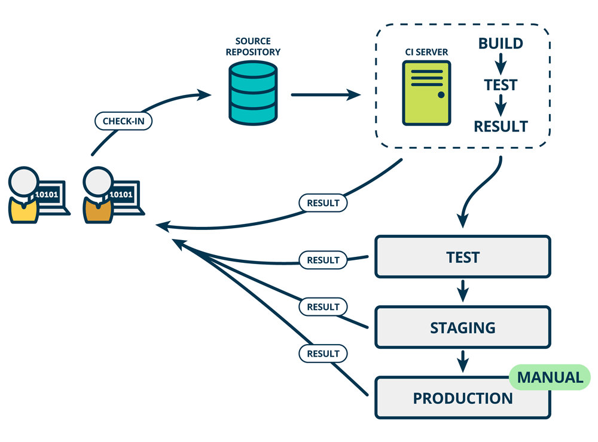
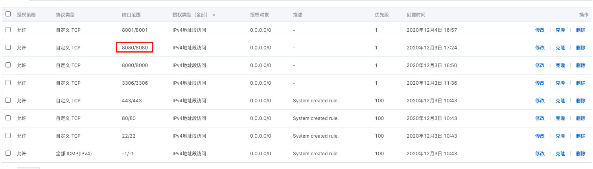
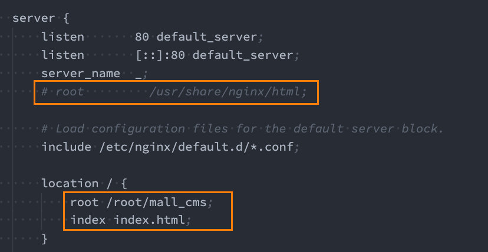

# 项目打包和自动化部署

## 一. 项目部署和 DevOps

### 1.1. 传统的开发模式

在传统的开发模式中，开发的整个过程是按部就班就行：


但是这种模式存在很大的弊端：

* 工作的不协调：开发人员在开发阶段，测试和运维人员其实是处于等待的状态。等到测试阶段，开发人员等待测试反馈 bug，也会处于等待状态。
* 线上 bug 的隐患：项目准备交付时，突然出现了 bug，所有人员需要加班、等待问题的处理；

### 1.2. DevOps 开发模式

DevOps 是 Development 和 Operations 两个词的结合，将开发和运维结合起来的模式：


### 1.3. 持续集成，持续交付和持续部署

伴随着 DevOps 一起出现的两个词就是**持续集成**和**持续交付**(部署)：

* CI 是 Continuous Integration（持续集成）；
* CD 是两种翻译：Continuous Delivery（持续交付）或 Continuous Deployment（持续部署）；

持续集成 CI：


持续交付和持续部署 CD：




### 1.4. 自动化部署流程


## 二. 购买云服务器

### 2.1. 注册阿里云的账号

云服务器我们可以有很多的选择：阿里云、腾讯云、华为云。

我们目前使用更加广泛的阿里云来讲解：

我们需要注册阿里云账号

* https://aliyun.com/

* 注册即可，非常简单

### 2.2. 购买云服务器

购买云服务器其实是购买一个实例。

1.来到控制台：


2.创建实例，选择类型和配置


3.配置网络安全组

- 什么协议可以访问，

- 哪些端口开放，

  > 访问一个服务器的 ip 地址，默认访问的是 80 端口。

- 允许哪些 IP 地址访问。


4.创建实例


5.如果已有服务器，执行以下2步操作，重置服务器环境。

1. 停止服务
2. 更换操作系统（重置环境）。

6.连接远程服务器：

- 简单方式：（windows 在）git bash上，

  ```shell
  ssh root@xxx.xxx.xxx.xxx
  ```

- 输入密码

## 三. 搭建服务器环境

### 3.1. jenkins 自动化部署

#### 3.1.1. 安装 Java 环境

Jenkins 本身是依赖 Java 的，所以我们需要先安装 Java 环境：

* 这里我安装了 Java1.8 的环境

```shell
dnf search java-1.8
dnf install java-1.8.0-openjdk.x86_64
```

> 安装最新的 Jekins，需要安装最新的 Java，即 Java17.

#### 3.1.2. 安装 Jenkins

因为 Jenkins 本身是没有在 dnf 的软件仓库包中的，所以我们需要连接 Jenkins 仓库：

* wget 是 Linux 中下载文件的一个工具，`-O` 表示输出到某个文件夹并且命名文件；
* rpm：全称为**The RPM Package Manage**，是 Linux 下一个软件包管理器；

```shell
wget –O /etc/yum.repos.d/jenkins.repo http://pkg.jenkins-ci.org/redhat-stable/jenkins.repo

# 导入 GPG 密钥以确保您的软件合法
rpm --import https://pkg.jenkins.io/redhat/jenkins.io.key
# 或者
rpm --import http://pkg.jenkins-ci.org/redhat/jenkins-ci.org.key
```

编辑一下文件 /etc/yum.repos.d/jenkins.repo

* 可以通过 vim 编辑

```
[jenkins]

name=Jenkins-stable

baseurl=http://pkg.jenkins.io/redhat

gpgcheck=1
```

安装 Jenkins

```shell
dnf install jenkins # --nogpgcheck(可以不加)
```

启动 Jenkins 的服务：

```shell
systemctl start jenkins
systemctl status jenkins
systemctl enable jenkins
```

Jenkins 默认使用 8080 端口提供服务，所以需要加入到安全组中：



通过服务器的 ip 和端口，访问 jenkins 的图形化界面，根据提示，去对应目录下查看管理员密码（cat xxx/xxx/xx），

安装推荐的插件。

创建一个管理员账户。

#### 3.1.3. Jenkins用户

我们后面会访问 centos 中的某些文件夹，默认 Jenkins 使用的用户是 `jenkins`，可能会没有访问权限，所以我们需要修改一下它的用户：

修改文件的路径：`/etc/sysconfig/jenkins`


其它修改权限的方式

```shell
# 也可以将 Jenkins 添加到 root 组中
sudo usermod -a -G root jenkins

# 也可以给 Jenkins 目录权限
chown -R jenkins  /xxx/xxx 
```

之后需要重启一下 Jenkins：

```shell
systemctl restart jenkins
```

#### 3.1.3 在服务器上安装 git

```shell
dnf install git
```

#### 3.1.4. Jenkins 配置

打开浏览器，输入：http://8.134.60.235:8080/

* 注意：你输入自己的 IP 地址

获取输入管理员密码：

* 在下面的地址中 `cat /var/lib/jenkins/secrets/initialAdminPassword`

可以安装推荐的插件：


#### 3.1.5. Jenkins任务

**新建任务：**


**配置项目和保留策略：**


**源码管理：**


**构建触发器：**

这里的触发器规则是这样的：

* 定时字符串从左往右分别是：分 时 日 月 周

```shell
#每半小时构建一次OR每半小时检查一次远程代码分支，有更新则构建
H/30 * * * *

#每两小时构建一次OR每两小时检查一次远程代码分支，有更新则构建
H H/2 * * *

#每天凌晨两点定时构建
H 2 * * *

#每月15号执行构建
H H 15 * *

#工作日，上午9点整执行
H 9 * * 1-5

#每周1,3,5，从8:30开始，截止19:30，每4小时30分构建一次
H/30 8-20/4 * * 1,3,5
```


**构建环境：**

注意：我们需要搭建 Node 的环境

* 第一步：配置 Node 的环境；
* 第二步：安装 Node 的插件；


第一步：配置Node的环境


第二步：安装Node的插件

* 这里因为我已经安装过了，所以没有搜索到；


构建执行的任务：

* 查看 Node 的版本等是否有问题；
* 执行 `npm install` 安装项目的依赖；
* 移除原来 mall_cms 文件的所有内容；
* 将打包的 dist 文件夹内容移动到 mall_cms 文件夹；

```shell
pwd
node -v
npm -v

npm install 
npm run build

pwd

echo '构建成功'

ls

# 删除 /root/mall_cms 文件夹里所有的内容
rm -rf /root/mall_cms/* 

cp -rf ./dist/* /root/mall_cms/
```


### 3.2. nginx 安装和配置

#### 3.2.1. 安装 nginx

nginx 可以做请求的代理，可配置负载均衡，高可用，高并发，支持很多其它协议，如 https，rtsp/rtmp（流媒体协议）

后续我们部署会使用 nginx，所以需要先安装一下 nginx：

```shell
dnf install nginx
```

> CentOS 8 之后自带工具 dnf，是 yum 的升级版。

启动 nginx：

```shell
systemctl start nginx
systemctl status nginx
systemctl enable nginx # 服务器重启后，自动开启服务。
```

#### 3.2.2. 配置 nginx

我们这里主要配置 nginx 的用户和默认访问目录

`/etc/nginx/nginx.config`配置用户：


通过 Linux 命令创建文件夹和文件：

```shell
mkdir /root/[projectName]
cd /root/[projectName]
touch index.html

vi index.html
```

来到`/etc/nginx/nginx.config`配置访问目录：



在 VScode 中远程修改配置文件

1. 安装 Remote SSH 插件。
2. 输入命令：`ssh root@[ip地址]`